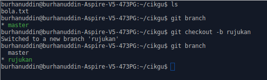

# Branch

*Branch* bermaksud cabang. Kita boleh menganggap branch sebagai niat atau tujuan
perubahan yang ingin kita lakukan.

Contohnya, katakanlah kita sedang menulis esei dan kita ingin menulis
pendahuluan, disebabkan tidak cukup masa, pendahuluan masih belum siap, maka
bahagian tersebut kita save dahulu dengan commit ke branch `pendahuluan`,
kemudian sambung pada lain hari. Esoknya, kita sambung tulis pendahuluan dan
commit perubahan ke branch `pendahuluan`. Setelah selesai, kita gabungkan branch
`pendahuluan` dengan branch `master`.

Branch `master` ialah cabang utama untuk code. Dari contoh di atas, katakanlah
kita terus commit pendahuluan ke branch `master`, maka orang akan terus dapat
baca pendahuluan yang masih belum siap.

Kita boleh membuat branch tidak kira berapa banyak yang kita mahu. Dengan ini,
kita boleh menggunakan branch jika kita berkerja dalam kumpulan. Contoh seorang
sedang menulis pendahuluan dalam branch `pendahuluan` dan seorang lagi menulis
penutup dalam branch `penutup`. Jadi, mereka tidak perlu berebut mana satu yang
perlu save dahulu.

## git branch

`git branch` ialah command untuk melihat senarai branch yang ada pada repository
kita. Jika anda mengikuti tutorial asas, anda boleh cuba `git branch` dalam
folder `cikgu` dan anda boleh lihat ada satu branch iaitu, `master`.

## git checkout

`git checkout` ialah command untuk bertukar branch. Dengan menambah flag `-b`
menjadi `git checkout -b`, command tersebut boleh create branch. Sekarang cuba
create branch dengan nama `rujukan`

```
git checkout -b rujukan
```

Kemudian, taip `git branch` sekali lagi untuk melihat branch yang ada. Dalam
console jika diperhatikan, branch `rujukan` berwarna hijau dan mempunyai
*asterisk*(*) di tepinya. Ini menandakan sekarang kita sedang berada dalam
branch `rujukan`.



Sekarang kita cuba commit sesuatu dalam branch `rujukan`. Tambah tajuk untuk
seksyen rujukan. Kandungan file `bola.txt` akan menjadi begini,

```
cikgu suka main bola
hari-hari cikgu main bola

rujukan:
```

Kemudian buat seperti biasa, `git add bola.txt` dan

```
git commit -m "Tambah seksyen rujukan"
```

## File bertukar mengikut branch

Ini antara kelebihan Git. Cuba tukar ke branch `master` semula menggunakan `git
checkout master`. Kemudian, buka file `bola.txt` dan kita boleh lihat file
tersebut tiada seksyen rujukan. Tukar semula ke branch `rujukan` (`git checkout
rujukan`) baru ada balik seksyen rujukan.

Kita boleh menggunakan teknik ini untuk membuat deployment. Katakanlah kita
membuat website. Code yang sudah siap berada di branch `master`. Kemudian, kita
nak tambah feature baru dalam website, kita commit feature baru ke branch `dev`
untuk development. Pada masa yang sama, bos suruh deploy website sekarang, maka
kita pun tukar ke branch `master`, deploy, tukar balik ke branch `dev`, sambung
develop feature baru.

----

Sekarang kita siapkan branch `rujukan` sebelum ini, kita tambah rujukan menjadi,

```
rujukan: masam masam manis - p ramlee
```

dan seperti biasa, `git add bola.txt`, dan

```
git commit -m "Tambah rujukan"
```

Pastikan anda berada dalam branch `rujukan` semasa commit.

## git merge

Ada dua cara untuk *merge*(gabungkan) branch ke branch `master`.

* Yang pertama, kita push ke website branch yang baru menggunakan `git push`.
Kemudian merge menggunakan website.
* Cara kedua, kita guna command `git merge`.

Untuk cara `git push`, contoh untuk push branch baru ke website cuma perlu tukar
nama ke branch baru, contohnya,

```
git push origin rujukan
```

Check website dan sepatutnya anda boleh lihat repository ada branch `rujukan`.
Godek-godek website untuk mencari cara untuk merge. Setelah berjaya, tukar
branch ke `master` di komputer kita dan pull daripada master (`git pull origin
master`) untuk mendapatkan update terkini.

Untuk cara `git merge`, tukar branch ke `master` di komputer. Kemudian taip `git
merge rujukan`. Setelah selesai boleh push ke master (`git push origin master`).

Saya lebih suka menggunakan cara pertama kerana di website boleh lihat perubahan
dengan lebih jelas.

## Delete branch

Setelah berjaya merge, kita boleh delete branch menggunakan `git branch -d
rujukan`. Kadang-kadang kita tidak boleh delete jika branch tersebut seperti
masih belum merge, maka kita boleh menggunakan `git branch -D rujukan` jika kita
yakin kita sudah merge.
