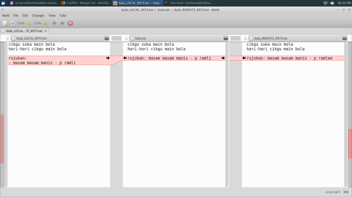

# Conflict

Memang tidak dapat dielakkan, ada masa mungkin beberapa branch terpaksa edit
line yang sama, dan ini akan mengakibatkan *conflict*. Jika ada conflict, branch
tidak boleh merge.

Jika ada conflict, kita boleh pilih sama ada untuk menggunakan `mergetool` atau
selesaikan secara manual.

Untuk demo, kita akan membuat conflict dengan sengaja.

Kita buat branch untuk `typo`.

```
git checkout -b typo
```

Kemudian betulkan nama `p ramli` ke `p ramlee` dan commit dengan message
`Betulkan ejaan`.

```
git add bola.txt
git commit -m "Betulkan ejaan"
```

Checkout ke master kembali, kemudian buat branch untuk `format`.

```
git checkout master
git checkout -b format
```

> Jika kita terus create branch sebelum tukar ke master, kita akan membuat
> branch daripada branch typo, tetapi kita mahu branch baru dari master.

Dalam branch `format`, tukar format rujukan seperti ini,

```
rujukan
- masam masam manis - p ramli
```

dan commit.

```
git add bola.txt
git commit -m "Tukar format"
```

Sekarang kita cuba merge kedua-dua branch tersebut.

```
git checkout master
git merge format
git merge typo
```

dan kita boleh lihat CONFLICT pada file `bola.txt` terpapar di console.

Buka file `bola.txt` dan kita dapat lihat file tersebut menjadi seperti berikut

```
cikgu suka main bola
hari-hari cikgu main bola

<<<<<<< HEAD
rujukan:
- masam masam manis - p ramli
=======
rujukan: masam masam manis - p ramlee
>>>>>>> typo
```

Line antara `<<<<<<< HEAD` dan `=======` ialah yang asal, dan line antara
`=======` dan `>>>>>>> typo` ialah yang kita mahu ubah.

Kita boleh menyelesaikan conflict ini secara manual dengan memilih line yang
baru kemudian tukar format menjadi,

```
rujukan:
- masam masam manis - p ramlee
```

Line-line yang lain seperti `<<<<<<< HEAD` dan `>>>>>>> typo` boleh dipadam.

Dalam situasi sebenar, kita mungkin perlu merujuk kepada programmer yang menulis
code yang asal supaya code kita tidak mengganggu code mereka. Komunikasi itu
penting semasa berkerja dalam kumpulan.

Setelah yakin conflict telah diselesaikan, commit seperti biasa.

```
git add bola.txt
git commit -m "Selesaikan conflict dengan menukar format rujukan dan membetulkan ejaan"
```

## git mergetool

`git mergetool` ialah command untuk membuka software yang boleh membantu
menyelesaikan conflict. Jika ada conflict, anda boleh taip `git mergetool`.

Jika tidak pernah guna, sepatutnya command tersebut akan memaparkan senarai
software yang boleh digunakan seperti ini:

```
This message is displayed because 'merge.tool' is not configured.
See 'git mergetool --tool-help' or 'git help config' for more details.
'git mergetool' will now attempt to use one of the following tools:
opendiff kdiff3 tkdiff xxdiff meld tortoisemerge gvimdiff diffuse diffmerge ecmerge p4merge araxis bc codecompare emerge vimdiff
```

Senarai software boleh dilihat di situ iaitu opendiff, kdiff3, tkdiff dan
lain-lain.

Saya ada setup meld untuk mergetool, rupanya begini:



Tetapi saya tidak pandai guna. Kalau anda suka menggunakan GUI, anda boleh
mencuba mana-mana software tersebut. Kawan sekerja saya dulu recommend p4merge.
